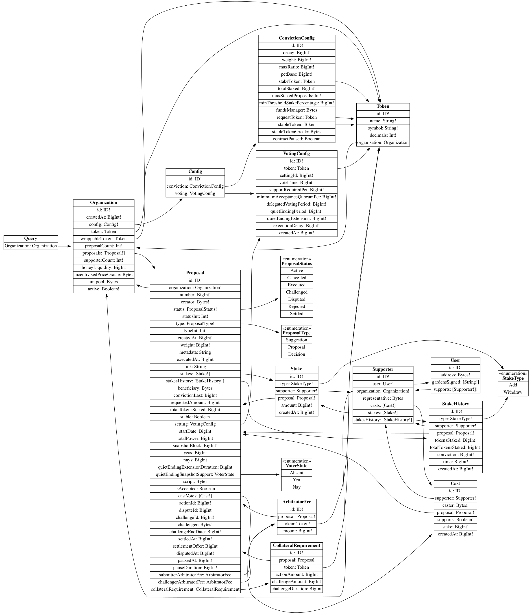

# Gardens Subgraph 🛰

Subgraph for [Gardens frontend](https://gardens-xdai.1hive.org/#/home).

Indexed data from DAOs created through the [GardensTemplate](https://github.com/1Hive/gardens/blob/master/packages/hardhat/contracts/GardensTemplate.sol).

## Current deployed subgraphs

|Network  | TheGraph | HTTP endpoint |
| ------------- | ------------- | ------------- |
| xDai | [Hosted Service](https://thegraph.com/hosted-service/subgraph/1hive/gardens-xdai) | https://api.thegraph.com/subgraphs/name/1hive/gardens-xdai |
| Polygon | [Hosted Service](https://thegraph.com/hosted-service/subgraph/1hive/gardens-polygon) | https://api.thegraph.com/subgraphs/name/1hive/gardens-polygon |
| Rinkeby | [Hosted Service](https://thegraph.com/hosted-service/subgraph/1hive/gardens-rinkeby) | https://api.thegraph.com/subgraphs/name/1hive/gardens-rinkeby |

## Schema



## Query example
The example show how to query a list of Gardens. 

```graphql
query Organizations($first: Int!, $skip: Int!, $orderBy: String!, $orderDirection: String!) {
    organizations(
      first: $first
      where: { active: true }
      skip: $skip
      orderBy: $orderBy
      orderDirection: $orderDirection
    ) {
      id
      active
      createdAt
      proposalCount
      token {
        id
        symbol
        name
        decimals
      }
      wrappableToken {
        id
        symbol
        name
        decimals
      }
      honeyLiquidity
      supporterCount
      incentivisedPriceOracle
      unipool
    }
  }
```
